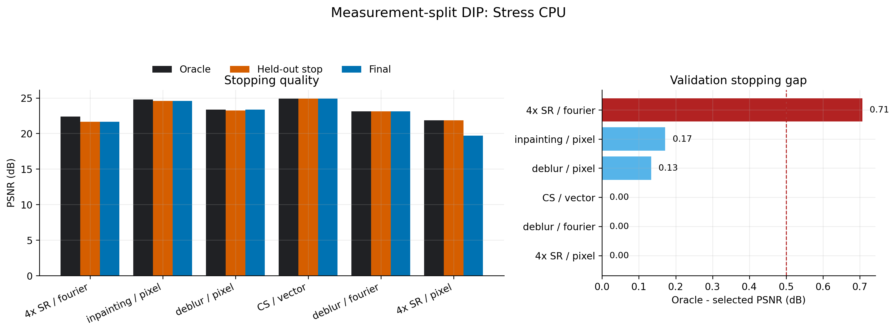
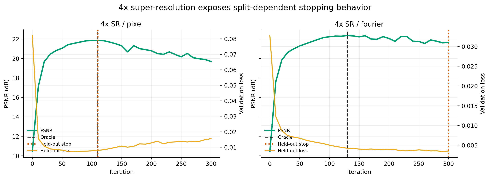
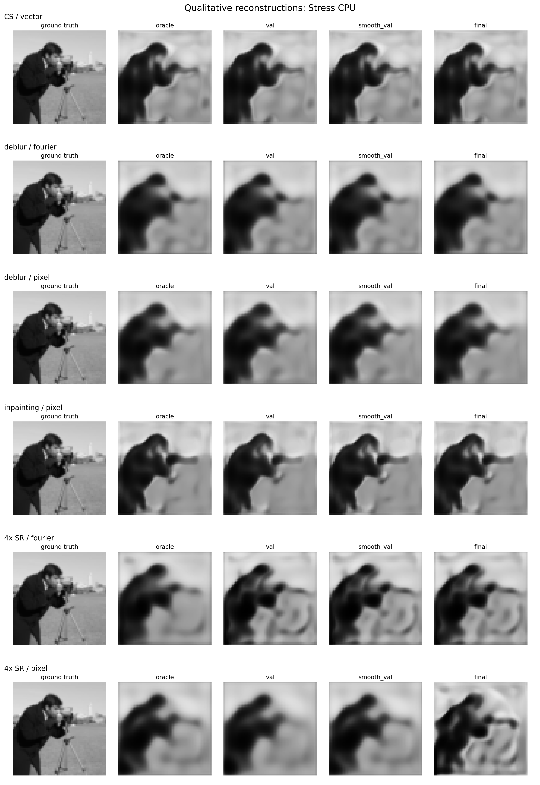
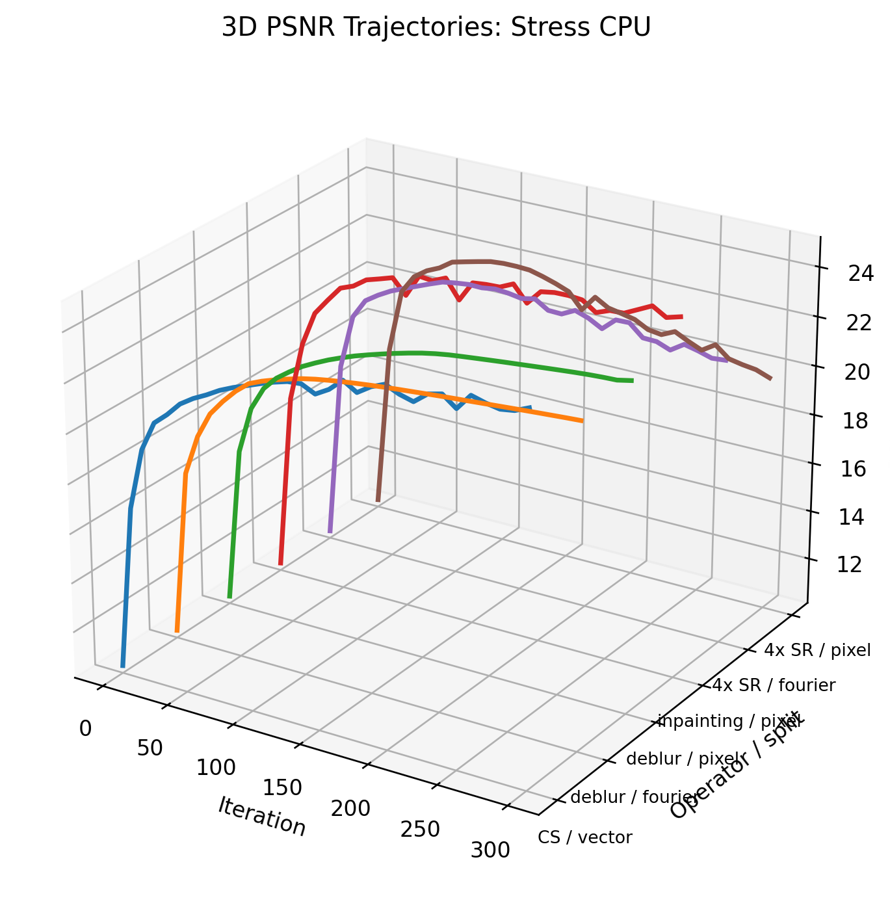

# Measurement-Split Deep Image Prior

Ground-truth-free early stopping for self-supervised inverse imaging.

This repository studies whether **held-out measurement consistency** can replace
ground-truth validation for stopping Deep Image Prior (DIP) reconstructions. The
central question is:

> Can a DIP network trained on one subset of measurements be stopped by how well
> it predicts held-out measurements from the same forward operator?

The current code runs end-to-end CPU pilots for inpainting, Fourier/subsampled
measurements, compressed sensing, deblurring, and super-resolution. It also
generates quantitative tables, qualitative reconstructions, publication-style
figures, and interactive Plotly dashboards.

## Result Snapshot

The strongest current finding is from noisy **4x super-resolution**. Pixel-domain
held-out validation selects the same iteration as oracle PSNR and avoids severe
DIP overfitting, while Fourier-domain validation misses the stopping point.





## Quantitative Results

Stress setting:

- image size: `64 x 64`
- seed: `1`
- inpainting noise: `0.08`
- compressed sensing sampling ratio: `0.3`, noise: `0.08`
- deblur blur sigma: `3.0`, noise: `0.05`
- super-resolution factor: `4`, noise: `0.05`

| Case | Oracle iter | Held-out iter | Oracle PSNR | Held-out PSNR | Final PSNR | Gap |
| --- | --- | --- | --- | --- | --- | --- |
| CS / vector | 300 | 300 | 24.89 | 24.89 | 24.89 | 0.00 |
| deblur / fourier | 300 | 300 | 23.13 | 23.13 | 23.13 | 0.00 |
| deblur / pixel | 300 | 280 | 23.37 | 23.24 | 23.37 | 0.13 |
| inpainting / pixel | 280 | 300 | 24.77 | 24.59 | 24.59 | 0.17 |
| 4x SR / fourier | 130 | 300 | 22.36 | 21.65 | 21.65 | 0.71 |
| 4x SR / pixel | 110 | 110 | 21.85 | 21.85 | 19.69 | 0.00 |

The gap is:

```text
oracle_psnr - psnr_at_held_out_stop
```

Interpretation:

- **Strong positive case:** 4x SR with pixel held-out validation stops at the
  oracle iteration and avoids a final PSNR drop from `21.85` to `19.69` dB.
- **Useful failure mode:** 4x SR with Fourier validation stops late and loses
  `0.71` dB, showing that split design matters.
- **Stable cases:** compressed sensing, deblurring, and inpainting stay close to
  oracle in these pilots.

## Qualitative Results

The reconstruction montage compares ground truth, oracle, held-out selected,
smoothed held-out selected, and final reconstructions.



## 3D And Interactive Visualizations

Static 3D PSNR trajectory view:



Interactive HTML files:

- [Figure index](figures/index.html)
- [Stress dashboard](figures/stress_cpu/stress_cpu_interactive_dashboard.html)
- [Stress 3D PSNR trajectories](figures/stress_cpu/stress_cpu_3d_psnr_trajectories.html)
- [Stress 3D validation-vs-PSNR dynamics](figures/stress_cpu/stress_cpu_3d_validation_psnr.html)
- [Pilot dashboard](figures/pilot_cpu/pilot_cpu_interactive_dashboard.html)

On GitHub, HTML files may need to be downloaded or opened from a local clone.

## Method

DIP reconstructs an image by optimizing an untrained convolutional network on a
single measurement:

```text
x_t = f_theta_t(z)
theta* = arg min_theta || A f_theta(z) - y ||^2
```

Measurement-split DIP partitions the measurement coordinates:

```text
y = (y_train, y_val)
A = (A_train, A_val)
```

Training uses only the reconstruction split:

```text
min_theta || A_train f_theta(z) - y_train ||^2
```

Stopping uses held-out measurement prediction:

```text
t_hat = arg min_t || A_val f_theta_t(z) - y_val ||^2
```

The ideal signal is:

```text
training loss keeps decreasing
validation loss decreases, then rises or plateaus
oracle PSNR peaks near the held-out validation minimum
```

## Why This Is Research-Worthy

Deep Image Prior avoids external training data, but in real inverse problems the
best stopping iteration is unknown because ground truth is unavailable. This
repository studies measurement-split validation as a **ground-truth-free stopping
criterion** and asks when it is reliable.

The key research claim is deliberately careful:

> Held-out measurement consistency can provide a practical self-supervised
> stopping signal for DIP, but its reliability depends on the forward operator,
> split design, noise level, and conditioning.

## Operator Coverage

Implemented forward operators:

- inpainting masks,
- Fourier/subsampled measurements,
- compressed sensing rows,
- Gaussian deblurring,
- super-resolution.

Splitting is strongest when measurement coordinates are naturally separable:

- MRI k-space,
- CT projection views,
- inpainting masks,
- compressed sensing rows,
- Fourier/subsampled measurements.

Splitting is more delicate for:

- deblurring,
- super-resolution.

The current stress results already show this nuance: 4x SR is highly
split-dependent.

## Installation

```bash
pip install -r requirements.txt
```

The current runs were generated on CPU-only PyTorch. CUDA will make larger sweeps
much faster.

## Reproduce Results

Run the fast pilot suite:

```powershell
powershell -ExecutionPolicy Bypass -File scripts/run_pilot_suite.ps1
```

Run the stress suite:

```powershell
powershell -ExecutionPolicy Bypass -File scripts/run_stress_suite.ps1
```

Regenerate tables, figures, qualitative montages, and interactive dashboards:

```bash
python scripts/make_visualizations.py results_pilot_cpu results_stress_cpu
```

Run a single experiment:

```bash
python scripts/run_experiment.py --operator superres --split-domain pixel --sr-factor 4 --iterations 300 --img-size 64
```

## Repository Layout

```text
measurement_split_dip_publication_study/
  README.md
  PILOT_RESULTS.md
  REPRODUCIBILITY.md
  requirements.txt
  figures/
    index.html
    pilot_cpu/
    stress_cpu/
  results_pilot_cpu/
  results_stress_cpu/
  scripts/
    run_experiment.py
    run_pilot_suite.ps1
    run_stress_suite.ps1
    make_visualizations.py
    summarize_results.py
  src/msdip/
    data.py
    metrics.py
    models.py
    operators.py
    train.py
    viz.py
```

## Literature Context

This project connects:

- **Deep Image Prior:** Ulyanov, Vedaldi, Lempitsky, CVPR 2018.
- **Measurement splitting / Noise2Inverse / SSDU:** self-supervision by
  predicting held-out measurement coordinates.
- **Equivariant Imaging and Equivariant Splitting:** self-supervised consistency
  under transformations.
- **SURE, UNSURE, Neighbor2Neighbor, R2R:** no-reference denoising and risk
  estimation baselines.
- **DeepInverse:** reference implementations for self-supervised inverse
  reconstruction losses.

## Next Publication-Grade Steps

To turn the pilot into a stronger paper:

1. Repeat across more seeds and images.
2. Add MRI k-space and CT-view splitting.
3. Compare against DeepInverse `SplittingLoss` and `EquivariantSplittingLoss`.
4. Add multi-split validation averaging.
5. Report distributions of validation-oracle gap, not only single examples.
6. Test sensitivity to split ratio, noise, blur severity, SR factor, and operator
   conditioning.

## Citation

See [CITATION.cff](CITATION.cff). Update the repository URL after publishing to
GitHub.

