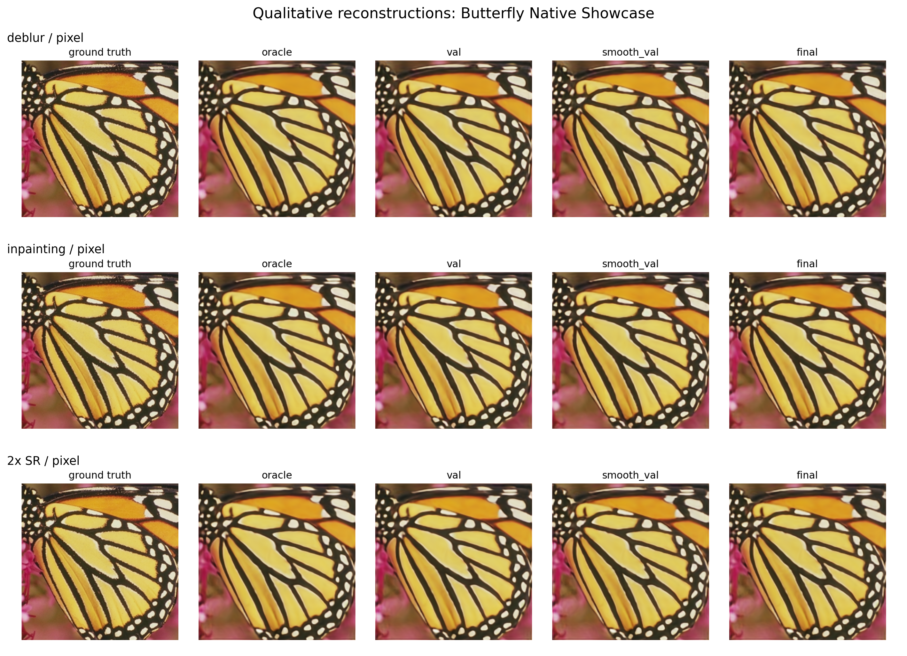

# Measurement-Split Deep Image Prior

Ground-truth-free early stopping for self-supervised inverse image reconstruction.

This repository implements and evaluates measurement-split validation for Deep
Image Prior (DIP). The method trains an untrained convolutional generator on one
subset of inverse-problem measurements and uses held-out measurement consistency
to select a reconstruction without access to ground truth.

## Motivation

Deep Image Prior can reconstruct an image from a single degraded measurement
without external training data. Its main practical limitation is early stopping:
the best reconstruction is often reached before the network fully minimizes the
measurement loss, but real inverse problems do not provide a clean reference
image for validation.

Measurement-split DIP addresses this by reserving part of the observed
measurement vector for validation. A useful stopping rule should select an
iteration close to the oracle PSNR peak while using only the forward operator and
the observed measurements.

## Method Overview

Let `A` denote the forward operator and `y` the observed measurement. Standard
DIP optimizes an untrained network `f_theta(z)` by minimizing:

```text
||A f_theta(z) - y||^2
```

Measurement-split DIP partitions the measurement coordinates:

```text
y = (y_train, y_val)
A = (A_train, A_val)
```

Training uses the reconstruction split:

```text
min_theta ||A_train f_theta(z) - y_train||^2
```

Model selection uses held-out measurement prediction:

```text
t_hat = arg min_t ||A_val f_theta_t(z) - y_val||^2
```

The implementation supports inpainting, Fourier subsampling, compressed
sensing, Gaussian deblurring, and super-resolution. Pixel, Fourier, and vector
measurement splits are provided depending on the operator.

## Key Results

The included results are deterministic CPU experiments intended to demonstrate
the implementation and the behavior of the stopping criterion across several
operators. Metrics are computed against available reference images for analysis;
the stopping rule itself uses only held-out measurements.

### Set5 Butterfly Showcase

The README showcase uses the Set5 butterfly image at its native `256 x 256`
resolution. The full image is used directly, without downsampling to a small
proxy resolution, and each DIP optimization runs for 900 iterations. These
settings make the qualitative reconstruction results meaningful while remaining
reproducible on CPU.



| Case | Oracle iter | Held-out iter | Oracle PSNR | Held-out PSNR | Final PSNR | Gap |
| --- | --- | --- | --- | --- | --- | --- |
| deblur / pixel | 750 | 870 | 27.92 | 27.88 | 26.97 | 0.04 |
| inpainting / pixel | 840 | 900 | 28.20 | 27.81 | 27.81 | 0.38 |
| 2x SR / pixel | 780 | 900 | 26.54 | 26.54 | 26.54 | 0.01 |

### Stress Suite

The stress suite uses stronger degradations to expose both successful and
operator-dependent stopping behavior.


| Case | Oracle iter | Held-out iter | Oracle PSNR | Held-out PSNR | Final PSNR | Gap |
| --- | --- | --- | --- | --- | --- | --- |
| CS / vector | 300 | 300 | 24.89 | 24.89 | 24.89 | 0.00 |
| deblur / fourier | 300 | 300 | 23.13 | 23.13 | 23.13 | 0.00 |
| deblur / pixel | 300 | 280 | 23.37 | 23.24 | 23.37 | 0.13 |
| inpainting / pixel | 280 | 300 | 24.77 | 24.59 | 24.59 | 0.17 |
| 4x SR / fourier | 130 | 300 | 22.36 | 21.65 | 21.65 | 0.71 |
| 4x SR / pixel | 110 | 110 | 21.85 | 21.85 | 19.69 | 0.00 |

The gap is defined as:

```text
oracle_psnr - psnr_at_held_out_stop
```

For noisy 4x super-resolution, pixel-domain validation selects the oracle
iteration and avoids late DIP overfitting. Fourier-domain validation stops later
in this configuration, illustrating that split design affects reliability.

## Repository Structure

```text
measurement_split_dip_publication_study/
  README.md
  REPRODUCIBILITY.md
  PILOT_RESULTS.md
  CITATION.cff
  LICENSE
  requirements.txt
  dip_experiments.ipynb
  figures/
    index.html
    butterfly_native_showcase/
    butterfly_lowdeg/
    butterfly_showcase/
    pilot_cpu/
    stress_cpu/
  results_butterfly_native_showcase/
  results_butterfly_lowdeg/
  results_butterfly_showcase/
  results_pilot_cpu/
  results_stress_cpu/
  scripts/
    download_set5.ps1
    run_experiment.py
    run_pilot_suite.ps1
    run_stress_suite.ps1
    make_visualizations.py
    summarize_results.py
  src/msdip/
    data.py
    metrics.py
    models.py
    operators.py
    train.py
    viz.py
```

## Installation

Python 3.10 or newer is recommended.

```bash
python -m venv .venv
source .venv/bin/activate
pip install -r requirements.txt
```

On Windows PowerShell:

```powershell
python -m venv .venv
.\.venv\Scripts\Activate.ps1
pip install -r requirements.txt
```

The experiments run on CPU. CUDA-enabled PyTorch can be used for larger sweeps.

The exploratory notebook uses DeepInverse:

```bash
pip install -r requirements-notebook.txt
```

## Dataset Preparation

The scripts can run with built-in scikit-image examples:

- `camera`
- `astronaut`
- `coins`

Custom images can be supplied with `--image-path`. Images are loaded with Pillow,
center-cropped to a square, converted to RGB or grayscale according to
`--channels`, and scaled to `[0, 1]`. By default the crop is resized to
`--img-size`. Use `--crop-size` with `--no-resize` to keep a native-resolution
crop or full native square image.

The Set5 butterfly showcase can be prepared with:

```powershell
powershell -ExecutionPolicy Bypass -File scripts/download_set5.ps1
```

This stores images under `data/set5/`. The `data/` directory is intentionally
ignored by Git.

## Running Experiments

Run a single experiment:

```bash
python scripts/run_experiment.py --operator superres --split-domain pixel --sr-factor 4 --iterations 300 --img-size 64
```

Common arguments:

- `--operator`: `inpainting`, `fourier`, `compressed_sensing`, `deblur`,
  `superres`, or `all`
- `--split-domain`: `pixel` or `fourier`
- `--image`: built-in image name
- `--image-path`: path to a local image
- `--img-size`: square reconstruction size
- `--crop-size`: optional center-crop size for local images
- `--no-resize`: keep the native crop size instead of resizing to `--img-size`
- `--channels`: `1` for grayscale or `3` for RGB
- `--iterations`: DIP optimization iterations
- `--noise-sigma`, `--blur-sigma`, `--sr-factor`, `--sampling-ratio`: operator
  parameters
- `--out`: output directory
- `--device`: `cpu` or `cuda`

Run the pilot and stress suites:

```powershell
powershell -ExecutionPolicy Bypass -File scripts/run_pilot_suite.ps1
powershell -ExecutionPolicy Bypass -File scripts/run_stress_suite.ps1
```

## Reproducing Included Results

Regenerate the pilot and stress figures:

```bash
python scripts/make_visualizations.py results_pilot_cpu results_stress_cpu
```

Regenerate the Set5 butterfly native-resolution showcase:

```powershell
powershell -ExecutionPolicy Bypass -File scripts/download_set5.ps1
python scripts/run_experiment.py --operator inpainting --iterations 900 --log-every 30 --img-size 256 --channels 3 --latent-channels 48 --hidden-channels 48 --start-size 16 --noise-sigma 0.0 --sampling-ratio 0.99 --image-path data\set5\Set5_HR\butterfly.png --crop-size 256 --no-resize --out results_butterfly_native_showcase --seed 4
python scripts/run_experiment.py --operator deblur --split-domain pixel --iterations 900 --log-every 30 --img-size 256 --channels 3 --latent-channels 48 --hidden-channels 48 --start-size 16 --noise-sigma 0.0 --blur-sigma 0.45 --image-path data\set5\Set5_HR\butterfly.png --crop-size 256 --no-resize --out results_butterfly_native_showcase --seed 4
python scripts/run_experiment.py --operator superres --split-domain pixel --sr-factor 2 --iterations 900 --log-every 30 --img-size 256 --channels 3 --latent-channels 48 --hidden-channels 48 --start-size 16 --noise-sigma 0.0 --image-path data\set5\Set5_HR\butterfly.png --crop-size 256 --no-resize --out results_butterfly_native_showcase --seed 4
python scripts/make_visualizations.py results_butterfly_native_showcase
```

## Expected Outputs

Each run directory contains:

- `history.csv`: iteration-wise losses, PSNR, SSIM, and output-change metrics
- `summary.json`: selected iterations and aggregate metrics
- `curves.png`: training, validation, PSNR, and SSIM trajectories
- `reconstructions.png`: oracle, held-out-selected, smoothed-validation, and
  final reconstructions

Visualization scripts produce:

- aggregate result tables
- PNG and PDF figures
- qualitative montages
- interactive Plotly HTML dashboards
- 3D PSNR and validation-dynamics plots

The figure index is available at [figures/index.html](figures/index.html).
GitHub does not render local interactive HTML directly; download the files or
open them from a local clone.

## Literature Context

This codebase is related to:

- Ulyanov, Vedaldi, and Lempitsky, "Deep Image Prior", CVPR 2018.
- Measurement-splitting methods for self-supervised inverse problems, including
  Noise2Inverse and SSDU.
- Equivariant imaging and equivariant-splitting losses.
- No-reference denoising and risk-estimation methods such as SURE, UNSURE,
  Neighbor2Neighbor, and R2R.
- DeepInverse reference implementations for self-supervised reconstruction
  losses.

## Citation

If this repository is useful in academic work, cite it using
[CITATION.cff](CITATION.cff).

## License

This project is released under the MIT License. See [LICENSE](LICENSE).
